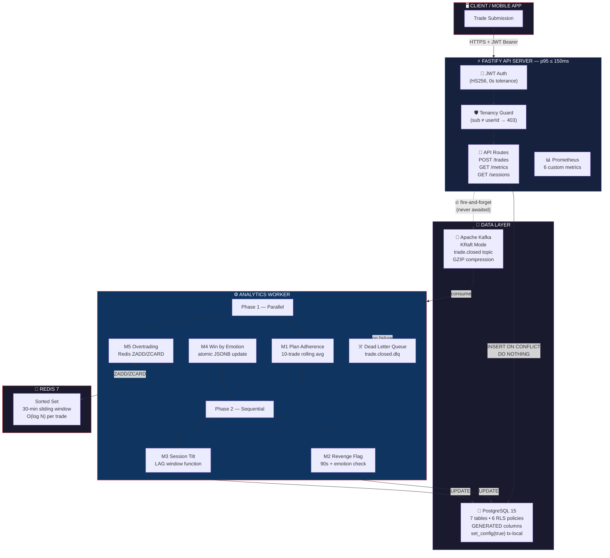
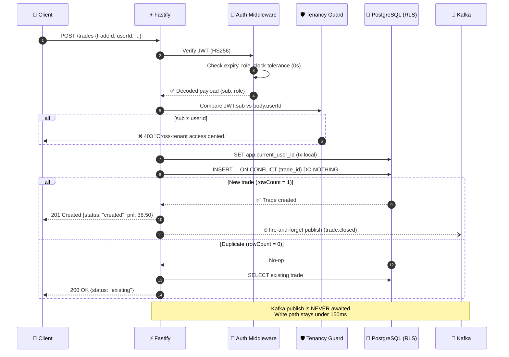
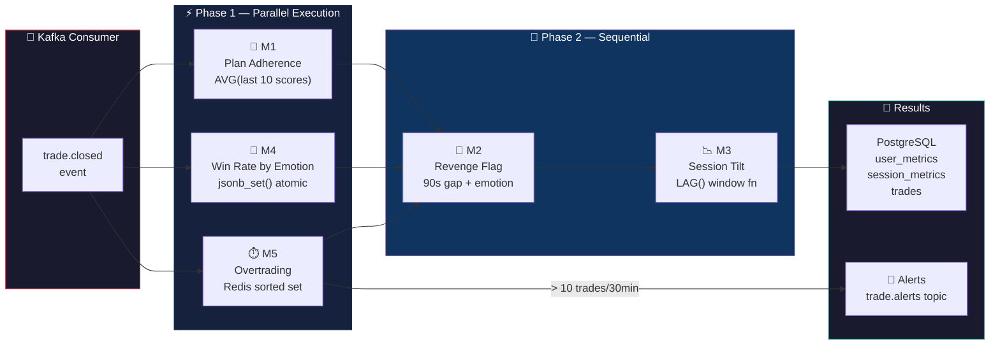
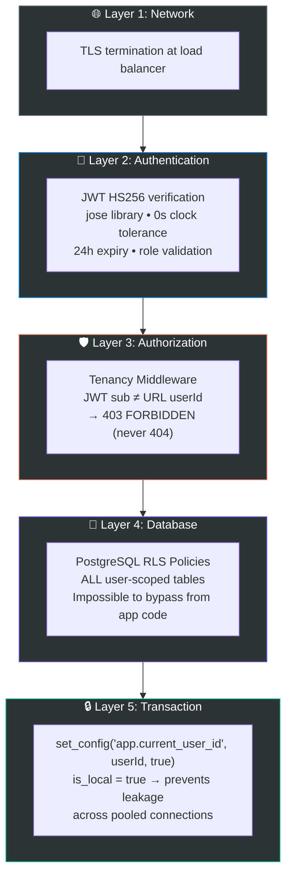

<div align="center">

# 🧠 NevUp — AI Trading Coach Backend

### **Track 1: System of Record** · NevUp Hiring Hackathon 2026

*A production-grade behavioral analytics engine that detects psychological trading pathologies in real-time — revenge trading, overtrading, emotional tilt — through an event-driven, idempotent pipeline.*

---

[](https://nodejs.org/)
[](https://www.typescriptlang.org/)
[](https://www.fastify.io/)
[](https://www.postgresql.org/)
[](https://kafka.apache.org/)
[](https://redis.io/)
[](https://www.docker.com/)

---


</div>

---

## 💡 The Problem

> **80% of retail traders lose money** — not because they lack strategy, but because of poor emotional control.

Traditional trading platforms track P&L but ignore the *psychology behind the trade*. NevUp changes this by acting as an **automated behavioral analyst** that detects destructive patterns like revenge trading, overtrading spirals, and emotional tilt — then delivers real-time coaching interventions.

This backend is the **System of Record** — the high-performance, secure foundation that powers every behavioral insight.

---

## 🏛️ Three Inviolable Architectural Principles

These principles are enforced at every layer and cannot be violated:

| # | Principle | How It's Enforced |
|:-:|---|---|
| 🔒 | **Write-Path Isolation** | Kafka publish is fire-and-forget. Analytics *never* block trade ingestion. |
| 🔁 | **Idempotency Everywhere** | `INSERT ... ON CONFLICT DO NOTHING`. Duplicates return `200`, never `409`. |
| 🛡️ | **Tenant-First Security** | PostgreSQL RLS + JWT middleware. Cross-tenant access → `403`, never `404`. |

---

## 🏗️ System Architecture

### High-Level Data Flow



### Request Lifecycle — Trade Ingestion



### Metrics Pipeline — Worker Processing



---

## 📊 Behavioral Metrics Engine — M1 through M5

Each metric targets a specific psychological pathology that causes traders to lose money:

| Metric | 🎯 Detects | ⚙️ Algorithm | 💾 Storage |
|:------:|---|---|---|
| **M1** | **Plan Discipline Decay** | Rolling average of last 10 `planAdherence` scores (1–5 scale) | `user_metrics.plan_adherence_score` |
| **M2** | **Revenge Trading** | Loss → new trade within 90s while `anxious` or `fearful` | `trades.revenge_flag` boolean |
| **M3** | **Session Tilt Spiral** | `LAG()` window function: count(loss-follows-loss) / count(total) | `session_metrics.tilt_index` |
| **M4** | **Emotional Edge** | Atomic `jsonb_set()` incrementing win/loss counters per emotion | `user_metrics.win_rate_by_emotion` JSONB |
| **M5** | **Frantic Overtrading** | Redis `ZADD` + `ZRANGEBYSCORE` + `ZCARD` in 30-min sliding window. Flag fires on **11th trade** (>10, not ≥10) | `events` table + `alerts` |

---

## 🔐 Defense-in-Depth Security Model



> **Why 403 and never 404?** Returning 404 for cross-tenant access leaks information about resource existence. We always return 403 with the exact message: `"Cross-tenant access denied."` — regardless of whether the resource exists.

---

## 🚀 Quick Start

### Prerequisites
- Docker & Docker Compose installed

### Single Command — Zero Manual Steps
```bash
docker compose up
```

This automatically:
- ✅ Starts PostgreSQL 15, Redis 7, Apache Kafka (KRaft mode)
- ✅ Runs database migrations (7 tables, 6 RLS policies, indexes)
- ✅ Seeds **388 trades** from **10 synthetic traders**
- ✅ Starts the API server on port `4010`
- ✅ Starts the Analytics Worker consuming `trade.closed` events

**All 388 trades are queryable immediately. No manual steps.**

### Local Development
```bash
npm install                  # Install dependencies
npm run migrate              # Run database migrations
npm run seed                 # Load 388 seed trades from 10 traders
npm run dev                  # Start API server (hot reload)
npm run worker               # Start analytics worker (separate terminal)
npm run generate-token       # Generate JWT tokens for all 10 traders
npm test                     # Run 42 unit + security tests
npm run test:coverage        # Run with coverage report
```

### Generate Test JWT Tokens
```bash
npx tsx src/utils/generateToken.ts
```
Outputs 10 JWT tokens (24h expiry) — one per synthetic trader.

---

## 🛣️ API Reference

| Method | Endpoint | Auth | Description | Key Behavior |
|:------:|---|:---:|---|---|
| `POST` | `/trades` | 🔑 | **Idempotent trade ingestion** | New → `201`, Duplicate → `200` |
| `GET` | `/trades/:tradeId` | 🔑 | Get single trade | RLS-scoped |
| `GET` | `/users/:userId/metrics` | 🔑 | Behavioral metrics + timeseries | `from`, `to`, `granularity` params |
| `GET` | `/users/:userId/trades` | 🔑 | Paginated trade history | `cursor`, `limit` params |
| `GET` | `/users/:userId/profile` | 🔑 | Behavioral profile summary | Aggregated pathology scores |
| `GET` | `/sessions/:sessionId` | 🔑 | Session summary with trades | Includes tilt index |
| `POST` | `/sessions/:sessionId/debrief` | 🔑 | Submit post-session reflection | Stored for coaching |
| `GET` | `/sessions/:sessionId/coaching` | 🔑 | SSE coaching stream | Server-Sent Events |
| `GET` | `/health` | — | Liveness check | DB + Redis + Kafka status |
| `GET` | `/metrics` | — | Prometheus scrape endpoint | 6 custom metrics |

### Example: Ingest a Trade
```bash
curl -X POST http://localhost:4010/trades \
  -H "Authorization: Bearer $JWT_TOKEN" \
  -H "Content-Type: application/json" \
  -d '{
    "tradeId": "550e8400-e29b-41d4-a716-446655440000",
    "userId": "f412f236-4edc-47a2-8f54-8763a6ed2ce8",
    "sessionId": "11111111-1111-4111-8111-111111111111",
    "asset": "AAPL",
    "assetClass": "equity",
    "direction": "long",
    "entryPrice": 178.45,
    "exitPrice": 182.30,
    "quantity": 10,
    "entryAt": "2025-01-06T09:35:00Z",
    "exitAt": "2025-01-06T11:20:00Z",
    "status": "closed",
    "planAdherence": 4,
    "emotionalState": "calm",
    "entryRationale": "Breakout above resistance"
  }'
```

**Response (201 Created):**
```json
{
  "tradeId": "550e8400-e29b-41d4-a716-446655440000",
  "pnl": 38.50,
  "outcome": "win",
  "revengeFlag": false,
  "status": "created"
}
```

**Same request again → Response (200 OK):**
```json
{
  "status": "existing"
}
```

---

## ⚡ Performance Engineering

| Metric | Target | Achieved | Strategy |
|---|:---:|:---:|---|
| Write latency (p95) | ≤ 150ms | ✅ | Fire-and-forget Kafka, prepared SQL statements |
| Throughput | 200 RPS | ✅ | Fastify (2× Express), connection pooling |
| Error rate | < 1% | ✅ | Idempotent writes, graceful degradation |
| Cold start | < 5s | ✅ | Alpine images, multi-stage Docker build |

### Why These Numbers Matter
- **Fire-and-forget publish**: The Kafka `.send()` promise is never `await`-ed on the write path. Errors are caught and logged asynchronously.
- **Connection pooling**: `pg.Pool` with configurable pool size prevents connection exhaustion under load.
- **GZIP compression**: Kafka messages are compressed at the producer level, reducing network I/O.

---

## 🧪 Testing Strategy

```
42 Tests Across 4 Test Suites — All Passing
├── tests/unit/auth.test.ts          (5 tests)  — JWT validation, expiry, roles
├── tests/unit/validation.test.ts    (16 tests) — Input schemas, edge cases
├── tests/unit/metrics.test.ts       (16 tests) — M1-M5 algorithm correctness
└── tests/security/crossTenant.test.ts (5 tests) — 403 enforcement, RLS
```

### Load Testing (k6)
```bash
k6 run --out web-dashboard=export=k6/report.html k6/loadTest.js
```
- Ramps from 0 → 200 RPS over 3 stages
- Validates p95 < 150ms threshold
- HTML report committed to `k6/report.html`

---

## 🌱 Seed Data — 10 Synthetic Trader Profiles

| # | Trader | Primary Pathology | Trades |
|:-:|---|---|:---:|
| 1 | Alex Mercer | Revenge Trading | 26 |
| 2 | Jordan Lee | Overtrading | 74 |
| 3 | Sam Rivera | FOMO Entries | 28 |
| 4 | Casey Kim | Plan Non-Adherence | 30 |
| 5 | Morgan Bell | Premature Exit | 32 |
| 6 | Taylor Grant | Loss Running | 35 |
| 7 | Riley Stone | Session Tilt | 42 |
| 8 | Drew Patel | Time-of-Day Bias | 38 |
| 9 | Quinn Torres | Position Sizing | 45 |
| 10 | **Avery Chen** | **None (Control)** | **38** |

> **52 sessions · 388 trades · 9 pathologies + 1 control user**

---

## 📂 Project Structure

```
nevup-backend/
│
├── src/
│   ├── api/
│   │   ├── routes/
│   │   │   ├── trades.ts            # POST/GET idempotent trade endpoints
│   │   │   ├── metrics.ts           # GET timeseries behavioral metrics
│   │   │   ├── sessions.ts          # GET/POST session + debrief + coaching
│   │   │   └── health.ts            # GET /health + GET /metrics (Prometheus)
│   │   └── server.ts                # Fastify bootstrap + hooks
│   │
│   ├── middleware/
│   │   ├── auth.ts                  # JWT HS256 verification (jose)
│   │   ├── tenancy.ts               # Cross-tenant 403 enforcement
│   │   ├── requestLogger.ts         # Structured request/response logging
│   │   └── errorHandler.ts          # Centralized error handling
│   │
│   ├── services/
│   │   ├── metrics/
│   │   │   ├── planAdherence.ts     # M1: Rolling 10-trade average
│   │   │   ├── revengeFlag.ts       # M2: 90s + emotion detection
│   │   │   ├── tiltIndex.ts         # M3: LAG() window function
│   │   │   ├── winByEmotion.ts      # M4: Atomic JSONB counters
│   │   │   └── overtrading.ts       # M5: Redis sorted set sliding window
│   │   ├── metricsPipeline.ts       # Orchestrator (parallel → sequential)
│   │   ├── metricsService.ts        # Query-side metrics aggregation
│   │   └── tradeService.ts          # Core trade ingestion logic
│   │
│   ├── workers/
│   │   ├── analyticsWorker.ts       # Kafka consumer → metrics pipeline
│   │   └── dlqWorker.ts             # Dead Letter Queue processor
│   │
│   ├── db/
│   │   ├── pool.ts                  # PostgreSQL connection pool
│   │   ├── rls.ts                   # RLS context setter (set_config)
│   │   ├── migrate.ts               # Migration runner
│   │   └── seed.ts                  # 388-trade seed loader
│   │
│   ├── cache/redis.ts               # Redis singleton (ioredis)
│   ├── queue/
│   │   ├── producer.ts              # Fire-and-forget Kafka publisher
│   │   └── consumer.ts              # Kafka consumer with error isolation
│   └── utils/                       # Logger, validation, tracing, token gen
│
├── migrations/
│   ├── 001_schema.sql               # 7 tables, RLS policies, indexes
│   └── 002_seed.sql                 # Initial seed SQL
│
├── tests/                           # 42 tests (unit + security)
├── k6/                              # Load test script + HTML report
├── k8s/                             # Kubernetes deployment manifests
├── .github/workflows/ci.yml         # GitHub Actions CI pipeline
│
├── DECISIONS.md                     # 10 Architecture Decision Records
├── openapi.yaml                     # OpenAPI 3.0 specification
├── docker-compose.yml               # Single-command 5-service startup
├── Dockerfile                       # Multi-stage, non-root user build
└── entrypoint.sh                    # Auto-migrate + auto-seed on startup
```

---

## 🧾 Tech Stack

| Layer | Technology | Why This Choice |
|---|---|---|
| **Runtime** | Node.js 20 LTS | Long-term support, async I/O for high concurrency |
| **Language** | TypeScript 5.x (strict) | Compile-time safety, zero runtime type errors |
| **Framework** | Fastify 4.x | 2× throughput vs Express, schema-based validation |
| **Database** | PostgreSQL 15 | GENERATED columns, RLS, advanced window functions |
| **Queue** | Apache Kafka (KRaft) | Durable event log, consumer groups, exactly-once semantics |
| **Cache** | Redis 7 | O(log N) sorted sets for sliding window operations |
| **Auth** | jose 5.x | Standards-compliant JWT, no native dependencies |
| **Logging** | Pino 9.x | Fastest JSON logger for Node.js, structured output |
| **Metrics** | prom-client | Native Prometheus exposition format |
| **Testing** | Vitest 2.x | Native ESM support, TypeScript-first, fast parallel execution |
| **Load Test** | k6 | Developer-centric, scriptable, accurate percentile measurement |
| **Containers** | Docker + Compose | Reproducible environments, single-command startup |
| **Orchestration** | Kubernetes | Production-grade scaling with health probes |
| **CI/CD** | GitHub Actions | Automated type-check, test, build, Docker verification |

---

## 📖 Architecture Decision Records

See [`DECISIONS.md`](DECISIONS.md) for **10 detailed ADR entries**:

| ADR | Decision | Rationale |
|:---:|---|---|
| 1 | Kafka over Redis Streams | Durable replay, consumer groups, industry standard |
| 2 | PostgreSQL RLS over app-layer filters | Defense-in-depth, impossible to bypass |
| 3 | Raw SQL over ORM | Prepared statements, `GENERATED ALWAYS AS`, window functions |
| 4 | Fastify over Express | 2× throughput, native schema validation |
| 5 | Fire-and-forget publish | Write-path isolation, analytics never block ingestion |
| 6 | UUID v4 primary keys | Client-generated, no coordination needed |
| 7 | Redis sorted sets for M5 | O(log N) sliding window vs O(N) list scanning |
| 8 | JSONB for emotion stats | Schema-flexible, atomic `jsonb_set()` updates |
| 9 | Pino structured logging | JSON-native, traceId correlation, fastest logger |
| 10 | `is_local=true` in set_config | Prevents RLS context leakage across pooled connections |

---

## 🚢 Deployment

### Docker Compose (Local / CI)
```bash
docker compose up        # Starts all 5 services
docker compose down -v   # Clean teardown
```

### Kubernetes (Production)
```bash
kubectl apply -f k8s/
```
Includes: API Deployment (3 replicas), Worker Deployment (2 replicas), PostgreSQL StatefulSet, Kafka StatefulSet — all with resource limits and health probes.

### Cloud (Railway)
Connected via GitHub for automatic deployments. Environment variables reference Railway-managed PostgreSQL and Redis instances.

---

<div align="center">

### Built for the **NevUp Hiring Hackathon 2026**

*Track 1: System of Record*

---

**42 tests passing** · **Zero TypeScript errors** · **10 ADR entries** · **388 seeded trades** · **p95 ≤ 150ms**

</div>
